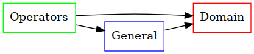
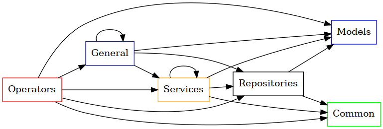

# **Aplicación**

La capa de aplicación encierra la **lógica de negocio** de cada sistema.
Es en esta área del código dónde se representan los elementos del
dominio de la aplicación (entendidos desde la perspectiva del Diseño Guiado
por el Dominio, DDD). Estos elementos corresponden a los modelos mentales que
hayamos creado para representar fenómenos, mecanismos y actividades del
mundo real y sobre los cuales nuestro sistema almacenará atributos,
creará relaciones y asignará comportamientos. La capa de aplicación es la que
captura el propósito de nuestro programa y la que representa el
**objetivo esencial** del sistema construido.

Por lo anterior, sólo con mirar la capa de aplicación debe ser posible
reconocer la utilidad del sistema y el tipo de *negocio* modelado por él. Así,
la capa de aplicación por ejemplo nos dice, si el programa en cuestión atiende
la industria hospitalaria y de la salud, o si representa un software académico
para universidades o si en cambio modela un sistema comercial de ventas en
línea. La capa de aplicación debe **gritar** el propósito del sistema, haciendo
evidente para qué ha sido construido.

En *KnowArkitecture* la capa de aplicación se divide a sí misma en múltiples
secciones, por lo que una mirada de alto nivel a su estructura de carpetas
sería:

```
    |-- tutorark
    |   |-- tutorark
    |   |   |-- application
    |   |   |   |-- domain
    |   |   |   |-- general
    |   |   |   |-- operation
    |   |   |   `-- __init__.py
    |   |   |-- ...
    |   `-- tests
    |       |-- application
    |       |   |-- domain
    |       |   |-- general
    |       |   |-- operation
    |       |   `-- __init__.py
    |       |-- ...

```
- [**Domain**](2_implantacion/2.1.1_domain.md)
    - [***Common***](2_implantacion/2.1.1.1_common.md)
    - [***Models***](2_implantacion/2.1.1.2_models.md)
    - [***Services***](2_implantacion/2.1.1.3_services.md)
    - [***Repositories***](2_implantacion/2.1.1.4_repositories.md)

- [**General**](2_implantacion/2.1.2_general.md)

- [**Operation**](2_implantacion/2.1.3_operation.md)
    - [***Common***](2_implantacion/2.1.3.1_common.md)
    - [***Informers***](2_implantacion/2.1.3.2_informers.md)
    - [***Managers***](2_implantacion/2.1.3.3_managers.md)

Las siguientes gráficas ilustran las dependencias entre los módulos que
pertenecen a la capa de aplicación:



